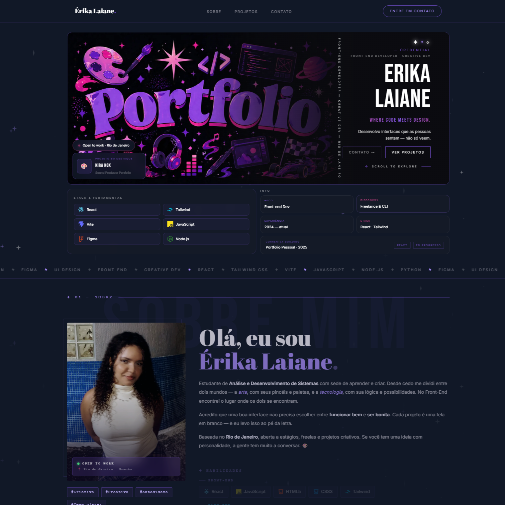

# ÉRIKA LAIANE — Portfolio Pessoal

<div align="center">


**Portfolio pessoal de Érika Laiane — Front-end Developer & Design Enthusiast 💜**

[](https://portfolio-erika-laiane.vercel.app/)

</div>

---

## Sobre o Projeto

Portfolio pessoal desenvolvido com foco em **design criativo e autoral**. O projeto combina ilustrações geradas com IA (editadas e adaptadas), animações com Framer Motion, glassmorphism e uma paleta dark com roxo e rosa — inspirado na estética de produtos digitais modernos.

### Características Principais

- Hero com ilustração autoral e parallax no mouse
- Marquee animado com pausa no hover
- Seção About completa com skills, experiência e educação
- GitHub Stats com dados reais via API (contribuições, repos, linguagens)
- Carrossel de projetos animado com modal de detalhes
- Formulário de contato funcional via Formspree
- Animações de entrada com Framer Motion
- Fundo animado com estrelas (StarsBg)
- Design responsivo mobile-first
- Deploy na Vercel

---

## Preview

<div align="center">



*Design dark com paleta roxo + rosa e ilustrações autorais*

</div>

---

## Tecnologias Utilizadas

| Tecnologia | Uso |
|---|---|
| **React 18** | Biblioteca de UI |
| **Vite** | Build tool |
| **Tailwind CSS v3** | Estilização utility-first |
| **Framer Motion** | Animações e transições |
| **JavaScript ES6+** | Lógica e interatividade |
| **Formspree** | Formulário de contato funcional |
| **GitHub API** | Dados de atividade em tempo real |
| **Vercel** | Deploy e hospedagem |

---

## Como Rodar o Projeto

### Pré-requisitos

- Node.js (versão 18 ou superior)
- npm

### Instalação

1. **Clone o repositório**

```bash
git clone https://github.com/erikalaiane/portfolio-erika-laiane.git
```

2. **Entre no diretório do projeto**

```bash
cd portfolio-erika-laiane
```

3. **Instale as dependências**

```bash
npm install
```

4. **Crie o arquivo de variáveis de ambiente** (opcional, para mais requests na GitHub API)

```bash
cp .env.example .env
# Adicione seu VITE_GITHUB_TOKEN no .env
```

5. **Inicie o servidor de desenvolvimento**

```bash
npm run dev
```

6. **Acesse no navegador**

```
http://localhost:5173
```

---

## Scripts Disponíveis

```bash
npm run dev      # Inicia o servidor de desenvolvimento
npm run build    # Cria a build de produção
npm run preview  # Visualiza a build de produção
npm run lint     # Executa o linter
```

---

## Estrutura do Projeto

```
portfolio-erika-laiane/
├── public/
│   └── preview.png
├── src/
│   ├── assets/
│   │   └── images/
│   │       ├── hero.webp        # Ilustração da hero
│   │       ├── about.jpg        # Ilustração do about
│   │       ├── contact.jpg      # Ilustração do contato
│   │       ├── proj-kira.jpg    # Preview Kira Nox
│   │       ├── proj-acelera.jpg # Preview Acelera Club
│   │       └── ...              # Demais previews
│   ├── components/
│   │   ├── Navbar.jsx           # Menu com glassmorphism e hover animado
│   │   ├── Hero.jsx             # Hero com parallax e cards flutuantes
│   │   ├── Marquee.jsx          # Faixa animada contínua
│   │   ├── About.jsx            # Skills, experiência e educação
│   │   ├── GitHubStats.jsx      # Dados reais via GitHub API
│   │   ├── Projects.jsx         # Carrossel + modal de projetos
│   │   ├── Contact.jsx          # Formulário via Formspree
│   │   ├── Footer.jsx           # Footer com links e filosofia
│   │   ├── StarsBg.jsx          # Fundo animado com estrelas
│   │   └── SectionHeader.jsx    # Cabeçalho padrão das seções
│   ├── App.jsx
│   ├── main.jsx
│   └── index.css
├── index.html
├── package.json
├── tailwind.config.js
├── postcss.config.js
└── vite.config.js
```

---

## Funcionalidades

### ✦ Hero
- Ilustração autoral com efeito parallax no mouse
- Cards flutuantes (Open to work · Projeto em destaque)
- Tagline vertical decorativa
- Animação gradiente no subtítulo
- Layout alternativo no mobile

### ✦ GitHub Stats
- Consumo da GitHub API com token opcional
- Diagrama orbital de atividade
- Contagem de contribuições e repositórios
- Linguagens mais usadas com barra visual
- Cards de repositórios recentes com hover

### ✦ Projetos
- Carrossel automático com pausa no hover
- Badge de destaque nos projetos principais
- Modal elegante com imagem, descrição e links
- Botões GitHub e Demo por projeto

### ✦ Contato
- Formulário funcional via Formspree
- Feedback visual de envio (enviando / enviado / erro)
- Links diretos para GitHub, LinkedIn, Instagram e Email

---

## Design System

### Paleta de Cores

```css
--bg-primary:    #111827  /* Fundo principal */
--bg-secondary:  #161b27  /* Cards e seções */
--purple-main:   #8B5CF6  /* Roxo primário */
--purple-light:  #A78BFA  /* Roxo suave */
--pink-main:     #EC4899  /* Rosa destaque */
--pink-light:    #F472B6  /* Rosa suave */
```

### Tipografia

- **Display**: Bebas Neue — títulos e números
- **Logo**: Abril Fatface — nome e seções editoriais
- **Corpo**: Inter — textos e descrições
- **Mono**: Courier New — labels e badges

---

## Padrões de Commit

```
feat:     Nova funcionalidade
fix:      Correção de bug
style:    Mudanças visuais
refactor: Refatoração de código
docs:     Alterações na documentação
chore:    Manutenção e configurações
```

---

## Licença

Este projeto está sob a licença MIT. Veja o arquivo [LICENSE](LICENSE) para mais detalhes.

---

## Autora

**Érika Laiane**

Estudante de Análise e Desenvolvimento de Sistemas — UniCarioca · Rio de Janeiro  
Apaixonada por Front-End criativo, UI Design e arte 🎨

[](https://github.com/erikalaiane)
[](https://www.linkedin.com/in/erika-laiane-azevedo)
[](mailto:erikalaianeazevedosantos@gmail.com)
[](https://portfolio-erika-laiane.vercel.app/)

---

<div align="center">

Desenvolvido com 💜 e muito café por Érika Laiane

**#FrontEnd** | **#ReactJS** | **#TailwindCSS** | **#Design** | **#CreativeDev**

[⬆ Voltar ao topo](#érika-laiane--portfolio-pessoal)

</div>